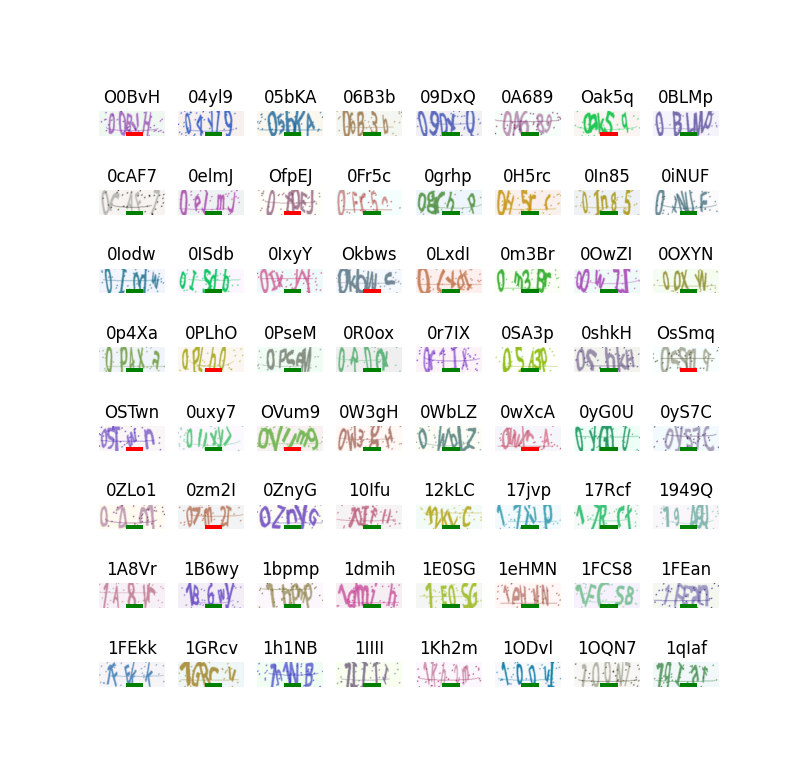
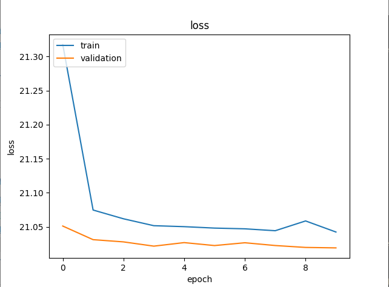

# Captcha Slayer

A custom CNN-based CAPTCHA solver for image-based CAPTCHAs, built from scratch using Keras.

## Overview

This project implements a convolutional neural network to automatically solve image-based CAPTCHAs. Rather than relying on pre-trained models or third-party APIs, I designed and trained a custom CNN architecture by working directly with the Keras documentation.

## Technical Approach

**Model Architecture:**
- Custom CNN designed specifically for CAPTCHA character recognition
- Built using Keras/TensorFlow
- Trained on synthetically generated CAPTCHA dataset
- [View the full data table here](/CaptchaSlayer-base.csv)
- [View the google sheets here (calculations)](https://docs.google.com/spreadsheets/d/e/2PACX-1vTp6OgSoT5ML6a_sfI2lCpMmkueIl8r5ZKvutVT_T6XzKxZeOjPm004m7fAQVqYKJ8xGRBJ1bPmZeWM/pubhtml)

**Data Pipeline:**
- Custom dataset generator for efficient training
- Automated CAPTCHA generation for creating training data
- Image preprocessing (grayscale conversion) to improve model performance

**Key Features:**
- End-to-end solution from data generation to trained model
- Benchmarking results available in `/results` folder
- Simple, lightweight architecture focused on efficiency

## Tech Stack

- **Framework:** Keras/TensorFlow
- **Image Processing:** OpenCV (grayscale preprocessing)
- **Dataset Generation:** [captcha](https://pypi.org/project/captcha/)

## Project Structure
```
captcha-slayer/
├── results/          # Benchmark images and performance metrics
├── [model files]     # Trained model weights
├── [training code]   # Dataset generation and training pipeline
└── README.md
```

## Results

Performance benchmarks and accuracy metrics can be found in the `/results` folder, including visual demonstrations of the model's predictions.

## What I Learned

- Designing CNN architectures from documentation
- Building custom data pipelines for ML training
- Image preprocessing techniques for improving model accuracy
- End-to-end ML project workflow from data generation to deployment

## Future Improvements

- Expand support for different CAPTCHA types
- Optimize model architecture for better accuracy
- Add real-time inference capabilities
- clean up dependencies and document them


## Results

<details>
<summary>Click to view performance metrics and examples</summary>



---

*Note: This project is for educational purposes only.*
